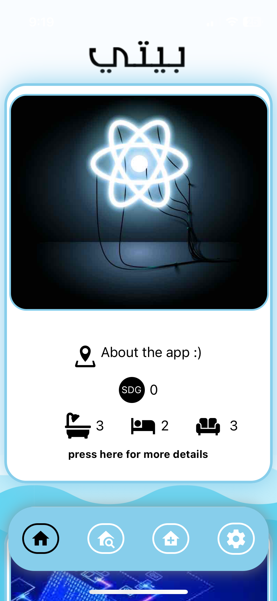
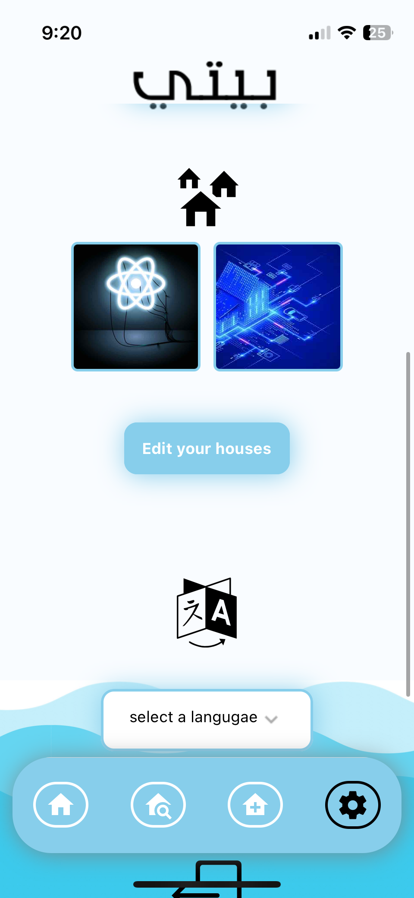
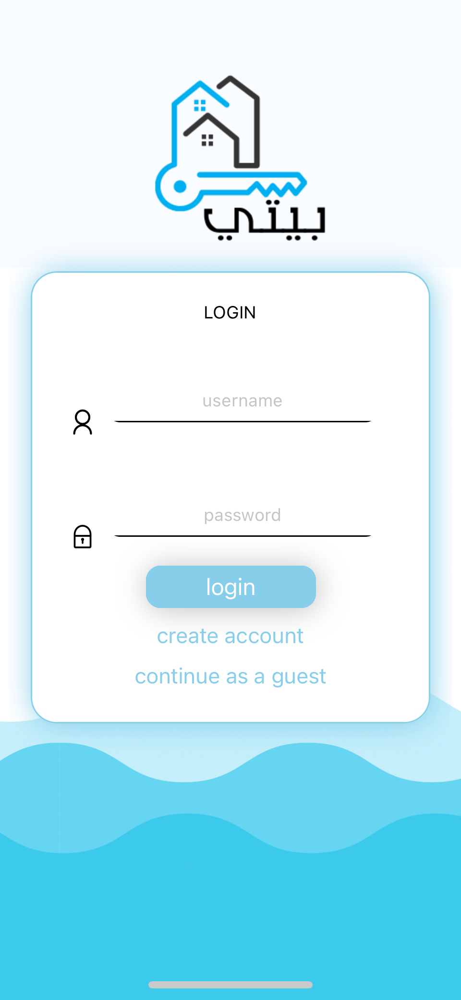
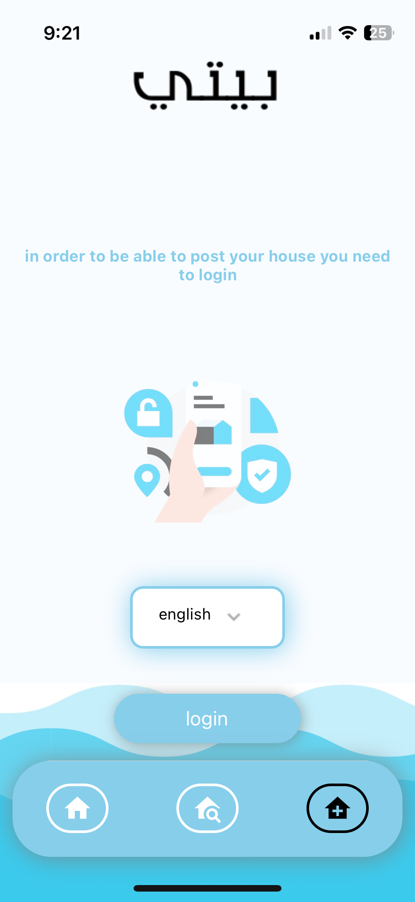

# youtube link to see the app https://youtu.be/2MiP_2mbvXg
# this app is fully done and ready for production

#this app is fully done and ready for production

# run the app localy 
## you need to install node.js and expo
### run ``` npm install ```
to install all packages  







# run the server 
###    ``` npm start ```
### if you are trying to run it on xcode 

#### press 'i'


