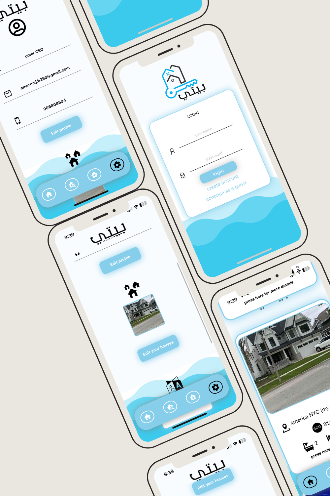
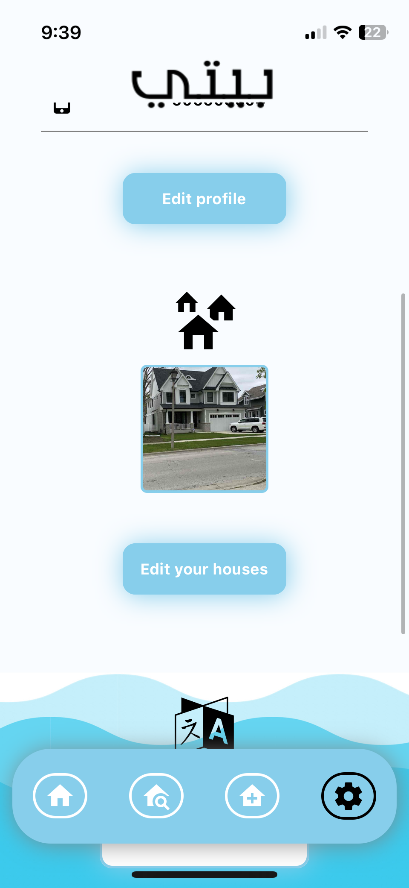
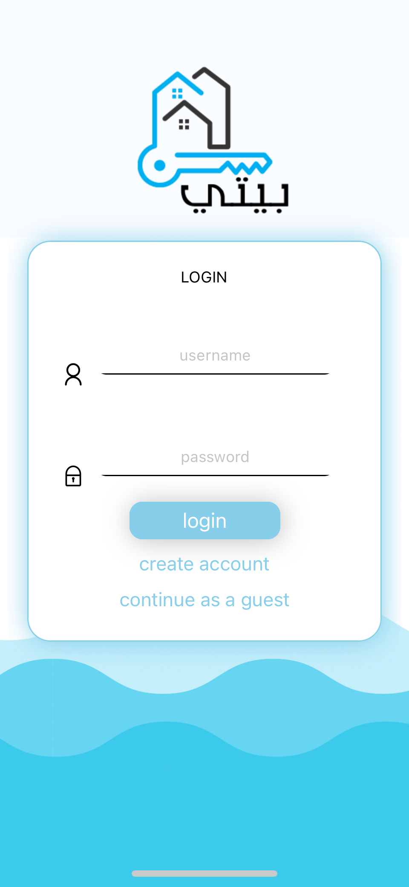
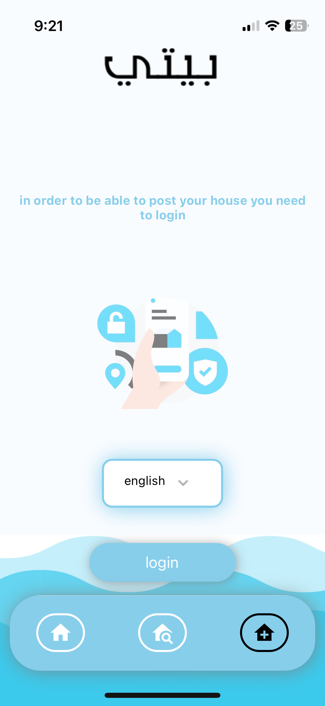
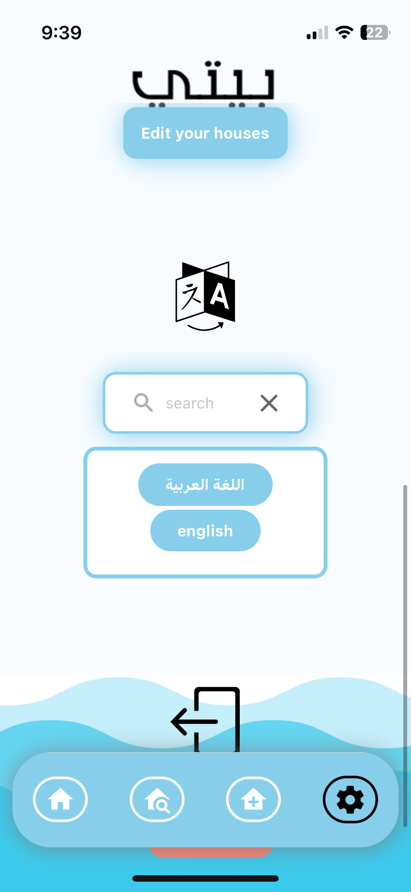
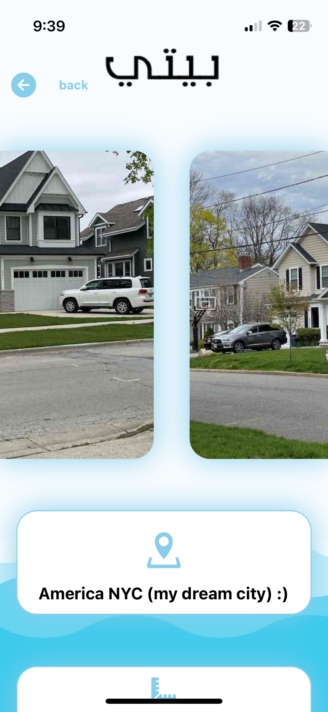

## youtube link to see the app https://youtu.be/2MiP_2mbvXg
- this app is fully done and ready for production
- the app was not released due to war outbreake in sudan 
- war in sudan made everyone leave their houses and over 7 million people are now homless or displaced 
- app will be relaesed as soon as the war is over 
- backend is live and you can call the following apis :
    - "https://www.baity.uk/house/" to get list of houses fromthe database
    
    - "https://www.baity.uk/owners/create/" ("GET") not allowed to create an account 
        - required data {username:your name , phone:your phone, email: your email, password:password}
     
    10+ more api endpoints to manage security authentication and CRUD operations for users and the houses can be found here : https://www.baity.uk/docs/

## run the app localy 
## you need to install node.js and expo
### run ``` npm install ```
to install all packages  


# run the server 
###    ``` npm start ```
## if you are trying to run it on xcode 

## press 'i'



#

#

#

#

#

#

